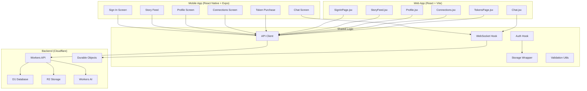

I have created the following plan after thorough exploration and analysis of the codebase. Follow the below plan verbatim. Trust the files and references. Do not re-verify what's written in the plan. Explore only when absolutely necessary. First implement all the proposed file changes and then I'll review all the changes together at the end.

## Observations

The current Heartfelt web app has critical issues preventing commercial launch:

**Security & Session Management**: No server-side token validation; second account can access first account's data (state isolation failure). Logout button hidden in navbar, not accessible on all pages. No token refresh or expiry handling.

**Design System Fragmentation**: Multiple conflicting color palettes (emerald/rose/pink on web, blue/purple on Profile page). No consistent typography, spacing, or component styling. Responsive design incomplete—mobile nav exists but desktop nav lacks logout.

**Information Architecture**: Dashboard (LandingPage) is weak—just 4 cards with no context. Navigation patterns inconsistent (navbar, bottom nav, links). No clear user flows for onboarding, profile creation, matching, or messaging.

**Visual Polish**: No loading states, empty states, or error boundaries. Inconsistent animations. No micro-interactions or feedback. Profile page uses hardcoded mock data and is completely disconnected from the app.

**Data Integrity**: No user data validation. Token balance fetched repeatedly. No optimistic updates. No conflict resolution for concurrent requests.

## Approach

Complete redesign of UI/UX to commercial-grade standards comparable to top global dating apps. Implement unified design system with consistent colors, typography, spacing, and components. Fix critical security issues: proper session management, server-side token validation, accessible logout. Redesign all pages with professional information architecture, clear navigation, and polished micro-interactions. Implement proper error handling, loading states, and empty states. Ensure fully responsive mobile-first design. Fix data integrity issues with proper user isolation and state management. No new features until core experience meets commercial standards.

## Implementation Steps

### Phase 1: Design System & Foundation (CRITICAL - Do First)

#### 1.1 Create Unified Design System
**File**: `src/styles/design-system.js`
- **Color Palette** (single, cohesive):
  - Primary: Rose-500 (#f43f5e) - main brand color, CTAs
  - Secondary: Emerald-500 (#10b981) - success, positive actions
  - Neutral: Slate-50 to Slate-900 - backgrounds, text, borders
  - Accent: Amber-500 (#f59e0b) - tokens, warnings
  - Semantic: Red-500 (errors), Blue-500 (info)
  - Remove: All blue/purple gradients, conflicting colors
- **Typography Scale**:
  - Display: 3xl (30px), 2xl (24px) - page titles
  - Heading: xl (20px), lg (18px) - section titles
  - Body: base (16px), sm (14px) - content
  - Caption: xs (12px) - metadata
  - Font: Inter (primary), system fonts fallback
- **Spacing Scale**: 4px, 8px, 12px, 16px, 24px, 32px, 48px, 64px
- **Border Radius**: 8px (sm), 12px (md), 16px (lg), 24px (xl)
- **Shadows**: sm, md, lg, xl variants
- **Transitions**: 150ms (fast), 300ms (normal), 500ms (slow)

#### 1.2 Create Reusable Component Library
**Directory**: `src/components/ui/`
- **Button.jsx**: Primary, secondary, tertiary, danger variants with loading states
- **Input.jsx**: Text, email, password, number with validation feedback
- **Select.jsx**: Dropdown with proper styling
- **Card.jsx**: Base card with optional header, footer, hover effects
- **Badge.jsx**: Status badges (online, offline, pending, connected)
- **Avatar.jsx**: User avatar with fallback, online indicator
- **Modal.jsx**: Centered modal with backdrop, animations
- **Toast.jsx**: Toast notifications (success, error, info, warning)
- **Skeleton.jsx**: Skeleton loaders matching content layout
- **EmptyState.jsx**: Empty state with icon, title, description, action
- **ErrorBoundary.jsx**: Global error boundary with recovery
- **LoadingOverlay.jsx**: Full-screen loading indicator

#### 1.3 Update Tailwind Configuration
**File**: `tailwind.config.js`
- Extend colors with unified palette (remove conflicting colors)
- Add custom spacing scale
- Add custom border radius
- Add custom shadows
- Add custom animations (fade, slide, scale)
- Ensure consistency across all utilities

#### 1.4 Create Global Styles
**File**: `src/index.css`
- Reset default styles
- Define base typography with consistent line-height
- Add utility classes for common patterns
- Add animation keyframes
- Ensure consistent letter-spacing

### Phase 2: Session Management & Security (CRITICAL - Do Second)

#### 2.1 Implement Proper Token Validation
**File**: `src/utils/auth.js`
- **Token Verification**: Validate token format and expiry on app load
- **Token Refresh**: Implement refresh token flow
  - Store refresh token in httpOnly cookie (backend requirement)
  - Refresh access token before expiry
  - Handle refresh failures gracefully
- **Token Revocation**: Clear tokens on logout
- **Session Timeout**: Implement idle timeout (15 minutes)
- **User Verification**: Verify user data matches token on load

#### 2.2 Enhance Auth Context
**File**: `src/context/AuthContext.jsx`
- **Session Validation**: Verify token validity on mount
- **User Data Isolation**: Ensure user data is properly scoped to current user
- **Logout Handling**: Clear all user data, tokens, and cache
- **Error Recovery**: Handle auth errors with proper fallback
- **Loading States**: Distinguish between initial load and subsequent operations
- **Refresh Logic**: Auto-refresh token before expiry

#### 2.3 Secure ProtectedRoute
**File**: `src/components/ProtectedRoute.jsx`
- **Token Validation**: Check token exists and is valid
- **User Verification**: Verify user data matches token
- **Redirect Logic**: Redirect to login if invalid
- **Loading State**: Show loading while validating
- **Error Handling**: Handle validation errors gracefully

#### 2.4 Implement Logout Everywhere
- **Add Logout Button**: Accessible from every page (in header/menu)
- **Logout Confirmation**: Confirm before logging out
- **Clear State**: Clear all user data, tokens, cache
- **Redirect**: Redirect to login page
- **Session Cleanup**: Notify backend to invalidate session

### Phase 3: Navigation & Information Architecture

#### 3.1 Redesign Navigation Structure
**File**: `src/components/Navigation/`
- **Header Component** (`Header.jsx`):
  - Logo/brand on left
  - User menu on right with:
    - Profile link
    - Settings link
    - Logout button (PROMINENT, always visible)
  - Responsive: hamburger menu on mobile
  - Sticky positioning with shadow on scroll
  
- **Sidebar Component** (`Sidebar.jsx`) - Desktop only:
  - Logo at top
  - Main navigation links with icons
  - Active state indicator
  - User info card at bottom with logout button
  
- **Bottom Navigation** (`BottomNav.jsx`) - Mobile only:
  - 5 main tabs: Home, Discover, Connections, Chat, Profile
  - Icons with labels
  - Active state with background
  - Badge for unread messages/requests
  - Safe area padding for notch

#### 3.2 Create Layout Components
**File**: `src/layouts/`
- **AuthLayout.jsx**: For login/signup pages (no navigation)
- **AppLayout.jsx**: For authenticated pages (header + sidebar/bottom nav)
- **ModalLayout.jsx**: For modal-based flows

#### 3.3 Implement Breadcrumb Navigation
**File**: `src/components/Breadcrumb.jsx`
- Show current location in app hierarchy
- Allow navigation to parent pages
- Responsive: hide on mobile if space-constrained

### Phase 4: Dashboard Redesign

#### 4.1 Redesign LandingPage
**File**: `src/pages/LandingPage.jsx`
- **Hero Section**:
  - Welcome message with user's name
  - Brief value proposition
  - Call-to-action (Explore Stories)
  
- **Quick Stats Section**:
  - 4 cards in grid: Connections, Sent Requests, Received Requests, Tokens
  - Each card shows count, icon, and link
  - Skeleton loaders while loading
  - Error state with retry button
  
- **Action Cards Section**:
  - Primary action: "Explore Stories" (large, prominent)
  - Secondary actions: "View Connections", "Check Messages", "Edit Profile"
  - Each card with icon, title, description
  - Hover effects and animations
  
- **Onboarding Prompts** (if profile incomplete):
  - "Complete your profile" card with progress
  - "Add photos" card
  - "Write your story" card
  
- **Recent Activity Section** (future):
  - Show recent connections, messages, likes
  - Timeline view with timestamps

#### 4.2 Add Proper Loading & Error States
- **Skeleton Loaders**: Show while fetching data
- **Error States**: Show error message with retry button
- **Empty States**: Show when no data exists
- **Refresh Button**: Allow manual refresh
- **Auto-refresh**: Refresh on tab visibility change

### Phase 5: Page Redesigns

#### 5.1 Redesign SignInPage
**File**: `src/pages/SignInPage.jsx`
- **Layout**: Split screen (desktop) or stacked (mobile)
- **Left Side** (desktop):
  - Brand logo and name
  - Value proposition
  - Key features list
  
- **Right Side** (desktop) / Full Width (mobile):
  - Tab switcher: "Sign In" / "Sign Up"
  - Form with proper validation
  - Error messages below each field
  - Loading state on button
  - Google OAuth button
  
- **Responsive**: Stack vertically on mobile, proper spacing
- **Accessibility**: Proper labels, ARIA attributes, keyboard navigation

#### 5.2 Redesign CreateProfile
**File**: `src/pages/CreateProfile.jsx`
- **Multi-step Form**:
  - Step 1: Basic Info (age, gender, nationality, location)
  - Step 2: Preferences (religion, race, education, kids, smoker, drinks)
  - Step 3: Story (text input with character count)
  - Step 4: Photos (upload, preview, face blur status)
  - Step 5: Review (confirm all data)
  
- **Progress Indicator**: Show current step and progress
- **Validation**: Real-time validation with error messages
- **Image Upload**:
  - Drag-and-drop support
  - Preview with blur status
  - Remove button for each image
  - Progress indicator for upload
  
- **Navigation**: Back/Next buttons, skip option (where appropriate)
- **Save Draft**: Auto-save progress
- **Completion**: Success message and redirect to feed

#### 5.3 Redesign StoryFeed
**File**: `src/pages/StoryFeed.jsx`
- **Header**:
  - Title: "Discover Stories"
  - Token balance display (prominent)
  - Filter button with active count badge
  
- **Filter Panel**:
  - Collapsible/modal on mobile
  - Organized by category (age, preferences, location)
  - Clear all button
  - Apply button
  
- **Card Stack**:
  - Large, beautiful cards with image
  - Swipe gestures (left/right/up)
  - Keyboard support (arrow keys)
  - Touch support (swipe on mobile)
  
- **Card Content**:
  - Image (blurred) with distance badge
  - Online status indicator
  - Age, gender, location
  - Tags: religion, race, education, kids, smoker, drinks
  - Story text (truncated with "read more")
  - Connection status badge
  
- **Actions**:
  - Pass button (left swipe)
  - Connect button (right swipe) - shows token cost
  - More info button (up swipe) - opens modal
  
- **States**:
  - Loading: Skeleton cards
  - Empty: Empty state with filter suggestions
  - Error: Error message with retry
  - No more: "No more stories" message
  
- **Undo**: Undo button for last action (with history)
- **Pagination**: Infinite scroll with loading indicator

#### 5.4 Redesign Connections Pages
**Files**: `src/pages/Connections.jsx`, `src/pages/SentRequests.jsx`, `src/pages/ReceivedRequests.jsx`
- **Tabbed Interface**:
  - Tab 1: Connections (established)
  - Tab 2: Sent Requests (pending)
  - Tab 3: Received Requests (pending)
  - Badge on tabs showing count
  
- **List View**:
  - Avatar, name, age, location
  - Status badge (online/offline)
  - Last message preview (for connections)
  - Action buttons (message, accept, reject, cancel)
  
- **Empty States**: Show when no data
- **Loading States**: Skeleton list items
- **Sorting**: Sort by recent, online status, etc.

#### 5.5 Redesign Chat
**File**: `src/pages/Chat.jsx`
- **Two-Column Layout** (desktop):
  - Left: Chat list (connections)
  - Right: Chat window
  
- **Single Column** (mobile):
  - Chat list with back button to open chat
  
- **Chat List**:
  - Avatar, name, last message
  - Unread badge
  - Timestamp of last message
  - Online status indicator
  - Swipe to delete (mobile)
  
- **Chat Window**:
  - Header: Avatar, name, online status, info button
  - Messages: Grouped by date, sender
  - Message bubbles: Different colors for sent/received
  - Delivery status: Sent, delivered, read
  - Typing indicator: "User is typing..."
  - Input area: Text input, emoji picker, send button
  - Scroll to bottom on new message
  
- **States**:
  - Loading: Skeleton messages
  - Empty: "No messages yet" with prompt to send first message
  - Error: Error message with retry
  - Disconnected: "Connection lost" with reconnect button

#### 5.6 Redesign Profile
**File**: `src/pages/Profile.jsx`
- **Header Section**:
  - Large avatar with edit button
  - Name, age, location
  - Online status
  - Edit profile button
  
- **Stats Section**:
  - Connections count
  - Sent requests count
  - Received requests count
  - Token balance (prominent)
  
- **Profile Sections**:
  - About: Story text
  - Preferences: Religion, race, education, kids, smoker, drinks
  - Photos: Grid of photos with blur status
  
- **Action Buttons**:
  - Edit Profile (primary)
  - Buy Tokens (secondary)
  - Settings (tertiary)
  - Logout (danger, PROMINENT)
  
- **Edit Mode**:
  - Inline editing for each section
  - Save/cancel buttons
  - Validation feedback
  - Success message on save

#### 5.7 Redesign TokensPage
**File**: `src/pages/TokensPage.jsx`
- **Header**:
  - Current balance (large, prominent)
  - Last purchase date
  
- **Token Packages**:
  - 3-4 package cards in grid
  - Package name, token count, price
  - Best value badge on recommended package
  - Buy button for each
  
- **Transaction History**:
  - Table or list of transactions
  - Type, amount, date, status
  - Pagination or infinite scroll
  
- **Payment Methods**:
  - Show available payment methods
  - Add new payment method button (future)

### Phase 6: Component Polish & Micro-interactions

#### 6.1 Loading States
- **Skeleton Loaders**: Match layout of actual content
- **Progress Indicators**: Show upload/download progress
- **Spinners**: Subtle, branded spinner for operations
- **Pulse Animation**: Gentle pulse for loading states

#### 6.2 Empty States
- **Illustrations**: Custom or stock illustrations
- **Messaging**: Clear, friendly copy
- **Actions**: Call-to-action button to populate data
- **Examples**: Show example data or next steps

#### 6.3 Error States
- **Error Messages**: Clear, actionable error text
- **Error Icons**: Visual indication of error
- **Retry Button**: Allow user to retry operation
- **Support Link**: Link to help/support (future)

#### 6.4 Success States
- **Toast Notifications**: Brief success message
- **Animations**: Subtle animation on success
- **Confirmation**: Show what was accomplished
- **Next Steps**: Suggest next action

#### 6.5 Animations & Transitions
- **Page Transitions**: Fade in/out between pages
- **Button Interactions**: Scale on hover/click
- **Card Animations**: Slide in on load
- **List Animations**: Stagger animation for list items
- **Modal Animations**: Slide up/fade in
- **Swipe Animations**: Smooth swipe gestures on cards

#### 6.6 Hover & Focus States
- **Buttons**: Change color, scale, shadow on hover
- **Links**: Underline, color change on hover
- **Cards**: Lift effect (shadow increase) on hover
- **Inputs**: Border color change on focus
- **Keyboard Navigation**: Visible focus ring

### Phase 7: Responsive Design

#### 7.1 Mobile-First Approach
- **Base Styles**: Design for mobile first
- **Breakpoints**: sm (640px), md (768px), lg (1024px), xl (1280px)
- **Touch Targets**: Minimum 44x44px for buttons
- **Spacing**: Adjust spacing for mobile (smaller)
- **Typography**: Adjust font sizes for mobile

#### 7.2 Responsive Components
- **Navigation**: Hamburger menu on mobile, sidebar on desktop
- **Grids**: 1 column on mobile, 2-3 columns on desktop
- **Modals**: Full screen on mobile, centered on desktop
- **Forms**: Single column on mobile, multi-column on desktop
- **Images**: Responsive images with proper aspect ratios

#### 7.3 Safe Area Handling
- **Notch Support**: Use safe-area-inset for notched devices
- **Bottom Navigation**: Account for home indicator on iOS
- **Keyboard**: Adjust layout when keyboard appears

### Phase 8: Error Handling & Recovery

#### 8.1 Global Error Boundary
**File**: `src/components/ErrorBoundary.jsx`
- Catch React errors
- Show error message with details
- Provide recovery options (reload, go home)
- Log errors for debugging

#### 8.2 API Error Handling
- **Network Errors**: Show "No internet" message with retry
- **Server Errors**: Show error message with status code
- **Validation Errors**: Show field-level error messages
- **Timeout**: Show timeout message with retry
- **Rate Limiting**: Show rate limit message with wait time

#### 8.3 User-Friendly Error Messages
- **Avoid Technical Jargon**: Use plain language
- **Suggest Solutions**: Tell user how to fix the problem
- **Provide Actions**: Offer retry, go back, contact support buttons
- **Consistent Tone**: Friendly, helpful, professional

### Phase 9: Data Integrity & State Management

#### 9.1 User Data Isolation
- **Verify User ID**: Ensure API calls include user ID
- **Validate Responses**: Verify response data matches user
- **Clear Cache**: Clear cache on logout
- **Session Validation**: Validate session on app load

#### 9.2 Optimistic Updates
- **Immediate Feedback**: Update UI before API response
- **Rollback on Error**: Revert UI if API fails
- **Loading States**: Show loading indicator during operation
- **Success Feedback**: Show success message on completion

#### 9.3 Caching Strategy
- **Token Balance**: Cache with 5-minute TTL
- **User Profile**: Cache with 10-minute TTL
- **Connection Counts**: Cache with 5-minute TTL
- **Manual Refresh**: Allow user to manually refresh

### Phase 10: Accessibility & Compliance

#### 10.1 WCAG Compliance
- **Color Contrast**: Ensure 4.5:1 contrast ratio for text
- **Keyboard Navigation**: All interactive elements keyboard accessible
- **ARIA Labels**: Proper ARIA labels for screen readers
- **Focus Management**: Visible focus indicators
- **Semantic HTML**: Use proper HTML elements

#### 10.2 Mobile Accessibility
- **Touch Targets**: Minimum 44x44px
- **Readable Text**: Minimum 16px font size
- **Zoom Support**: Allow pinch-to-zoom
- **Orientation**: Support both portrait and landscape

### Phase 11: Testing & QA

#### 11.1 Visual Testing
- **Cross-browser**: Test on Chrome, Firefox, Safari, Edge
- **Responsive**: Test on mobile, tablet, desktop
- **Dark Mode**: Test dark mode (if implemented)
- **Accessibility**: Test with screen readers

#### 11.2 Functional Testing
- **Authentication**: Test login, signup, logout flows
- **Navigation**: Test all navigation paths
- **Forms**: Test form validation and submission
- **API Integration**: Test all API calls
- **Error Handling**: Test error scenarios

#### 11.3 Performance Testing
- **Load Time**: Optimize for fast load times
- **Bundle Size**: Keep bundle size minimal
- **Animations**: Ensure smooth 60fps animations
- **Memory**: Monitor memory usage

### Phase 12: Documentation & Handoff

#### 12.1 Component Documentation
- **Storybook**: Document all components with examples
- **Props**: Document all component props
- **Usage**: Show common usage patterns
- **Variants**: Show all component variants

#### 12.2 Design System Documentation
- **Colors**: Document color palette with usage
- **Typography**: Document font sizes and weights
- **Spacing**: Document spacing scale
- **Shadows**: Document shadow styles
- **Animations**: Document animation patterns

#### 12.3 Developer Guide
- **Setup**: Instructions for setting up dev environment
- **Architecture**: Explain app architecture
- **Conventions**: Code style and naming conventions
- **Deployment**: Instructions for deploying to production

### 1. Create Shared Business Logic Directory

## File Structure After Redesign

```
src/
├── components/
│   ├── ui/                          # Reusable UI components
│   │   ├── Button.jsx
│   │   ├── Input.jsx
│   │   ├── Card.jsx
│   │   ├── Modal.jsx
│   │   ├── Toast.jsx
│   │   ├── Skeleton.jsx
│   │   ├── EmptyState.jsx
│   │   ├── ErrorBoundary.jsx
│   │   └── ...
│   ├── Navigation/
│   │   ├── Header.jsx
│   │   ├── Sidebar.jsx
│   │   ├── BottomNav.jsx
│   │   └── Breadcrumb.jsx
│   ├── animations/
│   │   ├── FadeIn.jsx
│   │   ├── SlideIn.jsx
│   │   └── ...
│   └── ...
├── layouts/
│   ├── AuthLayout.jsx
│   ├── AppLayout.jsx
│   └── ModalLayout.jsx
├── pages/
│   ├── auth/
│   │   └── SignInPage.jsx
│   ├── onboarding/
│   │   └── CreateProfile.jsx
│   ├── app/
│   │   ├── LandingPage.jsx
│   │   ├── StoryFeed.jsx
│   │   ├── Connections.jsx
│   │   ├── Chat.jsx
│   │   ├── Profile.jsx
│   │   └── TokensPage.jsx
│   └── ...
├── context/
│   ├── AuthContext.jsx
│   ├── ToastContext.jsx
│   └── ...
├── hooks/
│   ├── useAuth.js
│   ├── useWebSocket.js
│   ├── useToast.js
│   └── ...
├── utils/
│   ├── auth.js
│   ├── api.js
│   ├── validation.js
│   └── ...
├── styles/
│   ├── design-system.js
│   ├── index.css
│   └── ...
├── App.jsx
└── main.jsx
```

## Scope: Foundation Phase (This Session)

**Goal**: Establish the design system, fix critical security issues, and implement proper navigation. This unblocks all subsequent page redesigns.

**Deliverables**:
1. Unified design system (colors, typography, spacing, components)
2. Secure session management (token validation, logout everywhere)
3. Proper navigation structure (header + sidebar/bottom nav with logout)
4. Reusable UI component library (Button, Input, Card, Modal, Toast, etc.)
5. Global error boundary and loading states
6. Profile page fix (remove mock data, use unified design system)

**Not in scope this session**: Full page redesigns (StoryFeed, Chat, Connections, etc.), React Native app, advanced features.

## Implementation Steps

### Step 1: Create Unified Design System (2-3 hours)

#### 1.1 Update `tailwind.config.js`
**File**: `d:\heartfelt\tailwind.config.js`

Replace the current config with a unified, cohesive color palette and remove conflicting colors:

```javascript
// Remove: coral, peach, sunset-orange, romantic-gradient, sunset-gradient, warm-glow
// Add: Unified palette with Rose (primary), Emerald (success), Slate (neutral), Amber (accent)
```

**Changes**:
- **Primary Color**: Rose-500 (#f43f5e) for CTAs, brand elements
- **Success Color**: Emerald-500 (#10b981) for positive actions
- **Neutral Colors**: Slate-50 to Slate-900 for backgrounds, text, borders
- **Accent Color**: Amber-500 (#f59e0b) for tokens, warnings
- **Semantic Colors**: Red-500 (errors), Blue-500 (info)
- **Remove**: All conflicting gradients (romantic-gradient, sunset-gradient, warm-glow)
- **Keep**: Existing animations (heartbeat, sparkle, float, slideUp, shimmer)

#### 1.2 Update `src/index.css`
**File**: `d:\heartfelt\src\index.css`

Add base styles for consistent typography and spacing:

```css
@tailwind base;
@tailwind components;
@tailwind utilities;

@layer base {
  body {
    @apply bg-slate-50 text-slate-900;
    font-family: -apple-system, BlinkMacSystemFont, 'Segoe UI', Roboto, sans-serif;
  }

  h1 { @apply text-3xl font-bold; }
  h2 { @apply text-2xl font-bold; }
  h3 { @apply text-xl font-semibold; }
  h4 { @apply text-lg font-semibold; }
  
  p { @apply text-base leading-relaxed; }
  
  button { @apply transition-all duration-150; }
  input, select, textarea { @apply transition-colors duration-150; }
}

@layer components {
  .btn-primary {
    @apply rounded-lg bg-rose-500 px-4 py-2 font-semibold text-white hover:bg-rose-600 active:scale-95 disabled:opacity-50;
  }
  
  .btn-secondary {
    @apply rounded-lg border border-slate-200 bg-white px-4 py-2 font-semibold text-slate-700 hover:bg-slate-50 active:scale-95;
  }
  
  .card {
    @apply rounded-lg border border-slate-200 bg-white p-4 shadow-sm;
  }
}
```

#### 1.3 Create `src/styles/design-system.js`
**File**: `src/styles/design-system.js`

Document the design system for reference:

```javascript
export const designSystem = {
  colors: {
    primary: '#f43f5e',      // Rose-500
    success: '#10b981',      // Emerald-500
    warning: '#f59e0b',      // Amber-500
    error: '#ef4444',        // Red-500
    info: '#3b82f6',         // Blue-500
    neutral: {
      50: '#f8fafc',
      100: '#f1f5f9',
      200: '#e2e8f0',
      500: '#64748b',
      900: '#0f172a',
    },
  },
  typography: {
    fontFamily: {
      base: '-apple-system, BlinkMacSystemFont, "Segoe UI", Roboto, sans-serif',
    },
    fontSize: {
      xs: '12px',
      sm: '14px',
      base: '16px',
      lg: '18px',
      xl: '20px',
      '2xl': '24px',
      '3xl': '30px',
    },
  },
  spacing: {
    xs: '4px',
    sm: '8px',
    md: '12px',
    lg: '16px',
    xl: '24px',
    '2xl': '32px',
    '3xl': '48px',
  },
  borderRadius: {
    sm: '8px',
    md: '12px',
    lg: '16px',
    xl: '24px',
  },
  shadows: {
    sm: '0 1px 2px rgba(0,0,0,0.05)',
    md: '0 4px 6px rgba(0,0,0,0.1)',
    lg: '0 10px 15px rgba(0,0,0,0.1)',
    xl: '0 20px 25px rgba(0,0,0,0.1)',
  },
};
```

### Step 2: Create Reusable UI Component Library (2-3 hours)

#### 2.1 Create `src/components/ui/Button.jsx`
**File**: `src/components/ui/Button.jsx`

```javascript
import React from 'react';
import { motion } from 'framer-motion';

const Button = ({
  children,
  variant = 'primary',
  size = 'md',
  loading = false,
  disabled = false,
  className = '',
  ...props
}) => {
  const baseClass = 'font-semibold rounded-lg transition-all duration-150 active:scale-95 disabled:opacity-50 disabled:cursor-not-allowed';
  
  const variants = {
    primary: 'bg-rose-500 text-white hover:bg-rose-600',
    secondary: 'bg-white border border-slate-200 text-slate-700 hover:bg-slate-50',
    tertiary: 'bg-transparent text-rose-500 hover:bg-rose-50',
    danger: 'bg-red-500 text-white hover:bg-red-600',
  };
  
  const sizes = {
    sm: 'px-3 py-1.5 text-sm',
    md: 'px-4 py-2 text-base',
    lg: 'px-6 py-3 text-lg',
  };
  
  return (
    <motion.button
      whileHover={{ scale: disabled ? 1 : 1.02 }}
      whileTap={{ scale: disabled ? 1 : 0.98 }}
      disabled={disabled || loading}
      className={`${baseClass} ${variants[variant]} ${sizes[size]} ${className}`}
      {...props}
    >
      {loading ? '...' : children}
    </motion.button>
  );
};

export default Button;
```

#### 2.2 Create `src/components/ui/Card.jsx`
**File**: `src/components/ui/Card.jsx`

```javascript
import React from 'react';

const Card = ({ children, className = '', ...props }) => (
  <div
    className={`rounded-lg border border-slate-200 bg-white p-4 shadow-sm ${className}`}
    {...props}
  >
    {children}
  </div>
);

export default Card;
```

#### 2.3 Create `src/components/ui/Modal.jsx`
**File**: `src/components/ui/Modal.jsx`

```javascript
import React from 'react';
import { motion, AnimatePresence } from 'framer-motion';

const Modal = ({ isOpen, onClose, title, children, actions }) => (
  <AnimatePresence>
    {isOpen && (
      <motion.div
        initial={{ opacity: 0 }}
        animate={{ opacity: 1 }}
        exit={{ opacity: 0 }}
        onClick={onClose}
        className="fixed inset-0 z-50 flex items-center justify-center bg-slate-900/40 p-4"
      >
        <motion.div
          initial={{ scale: 0.95, opacity: 0 }}
          animate={{ scale: 1, opacity: 1 }}
          exit={{ scale: 0.95, opacity: 0 }}
          onClick={(e) => e.stopPropagation()}
          className="w-full max-w-md rounded-lg bg-white shadow-lg"
        >
          {title && (
            <div className="border-b border-slate-200 px-6 py-4">
              <h2 className="text-xl font-semibold text-slate-900">{title}</h2>
            </div>
          )}
          <div className="px-6 py-4">{children}</div>
          {actions && (
            <div className="border-t border-slate-200 flex gap-3 px-6 py-4">
              {actions}
            </div>
          )}
        </motion.div>
      </motion.div>
    )}
  </AnimatePresence>
);

export default Modal;
```

#### 2.4 Create `src/components/ui/Toast.jsx`
**File**: `src/components/ui/Toast.jsx`

```javascript
import React, { useEffect } from 'react';
import { motion, AnimatePresence } from 'framer-motion';

const Toast = ({ message, type = 'info', onClose, duration = 3000 }) => {
  useEffect(() => {
    const timer = setTimeout(onClose, duration);
    return () => clearTimeout(timer);
  }, [onClose, duration]);

  const bgColor = {
    success: 'bg-emerald-50 text-emerald-700 border-emerald-200',
    error: 'bg-red-50 text-red-700 border-red-200',
    info: 'bg-blue-50 text-blue-700 border-blue-200',
    warning: 'bg-amber-50 text-amber-700 border-amber-200',
  }[type];

  return (
    <AnimatePresence>
      <motion.div
        initial={{ y: 100, opacity: 0 }}
        animate={{ y: 0, opacity: 1 }}
        exit={{ y: 100, opacity: 0 }}
        className={`fixed bottom-4 right-4 rounded-lg border px-4 py-3 ${bgColor}`}
      >
        {message}
      </motion.div>
    </AnimatePresence>
  );
};

export default Toast;
```

#### 2.5 Create `src/components/ui/Skeleton.jsx`
**File**: `src/components/ui/Skeleton.jsx`

```javascript
import React from 'react';

const Skeleton = ({ className = '' }) => (
  <div
    className={`animate-shimmer rounded bg-gradient-to-r from-slate-200 via-slate-100 to-slate-200 bg-[length:200%_100%] ${className}`}
  />
);

export default Skeleton;
```

#### 2.6 Create `src/components/ui/EmptyState.jsx`
**File**: `src/components/ui/EmptyState.jsx`

```javascript
import React from 'react';

const EmptyState = ({ icon, title, description, action }) => (
  <div className="flex flex-col items-center justify-center py-12 text-center">
    {icon && <div className="mb-4 text-5xl">{icon}</div>}
    <h3 className="mb-2 text-lg font-semibold text-slate-900">{title}</h3>
    {description && <p className="mb-6 text-sm text-slate-600">{description}</p>}
    {action && <div>{action}</div>}
  </div>
);

export default EmptyState;
```

#### 2.7 Create `src/components/ui/ErrorBoundary.jsx`
**File**: `src/components/ui/ErrorBoundary.jsx`

```javascript
import React from 'react';

class ErrorBoundary extends React.Component {
  constructor(props) {
    super(props);
    this.state = { hasError: false, error: null };
  }

  static getDerivedStateFromError(error) {
    return { hasError: true, error };
  }

  componentDidCatch(error, errorInfo) {
    console.error('Error caught:', error, errorInfo);
  }

  render() {
    if (this.state.hasError) {
      return (
        <div className="flex min-h-screen flex-col items-center justify-center bg-slate-50 px-4">
          <div className="max-w-md rounded-lg bg-white p-6 shadow-md">
            <h1 className="mb-2 text-2xl font-bold text-red-600">Oops!</h1>
            <p className="mb-4 text-slate-600">Something went wrong. Please try refreshing the page.</p>
            <button
              onClick={() => window.location.reload()}
              className="w-full rounded-lg bg-rose-500 px-4 py-2 font-semibold text-white hover:bg-rose-600"
            >
              Refresh Page
            </button>
          </div>
        </div>
      );
    }

    return this.props.children;
  }
}

export default ErrorBoundary;
```

### Step 3: Fix Session Management & Security (2-3 hours)

#### 3.1 Create `src/utils/auth.js`
**File**: `src/utils/auth.js`

```javascript
// Token validation and session management utilities
export const validateToken = (token) => {
  if (!token) return false;
  try {
    // Basic JWT validation: check if it has 3 parts
    const parts = token.split('.');
    if (parts.length !== 3) return false;
    
    // Decode payload (don't verify signature on client, backend does that)
    const payload = JSON.parse(atob(parts[1]));
    
    // Check if token is expired
    if (payload.exp && payload.exp * 1000 < Date.now()) {
      return false;
    }
    
    return true;
  } catch (error) {
    return false;
  }
};

export const getTokenExpiry = (token) => {
  try {
    const payload = JSON.parse(atob(token.split('.')[1]));
    return payload.exp ? new Date(payload.exp * 1000) : null;
  } catch {
    return null;
  }
};

export const isTokenExpiringSoon = (token, minutesThreshold = 5) => {
  const expiry = getTokenExpiry(token);
  if (!expiry) return false;
  const now = new Date();
  const timeUntilExpiry = expiry.getTime() - now.getTime();
  return timeUntilExpiry < minutesThreshold * 60 * 1000;
};

export const clearAuthData = () => {
  localStorage.removeItem('token');
  localStorage.removeItem('user');
  sessionStorage.clear();
};
```

#### 3.2 Update `src/context/AuthContext.jsx`
**File**: `src/context/AuthContext.jsx`

Add proper token validation and session management:

```javascript
// Add to useEffect in refreshAuth():
const token = localStorage.getItem('token');
if (token && !validateToken(token)) {
  // Token is invalid, clear it
  clearAuthData();
  setToken(null);
  setUser(null);
  setLoading(false);
  return;
}

// Add auto-refresh logic:
useEffect(() => {
  if (!token) return;
  
  const expiry = getTokenExpiry(token);
  if (!expiry) return;
  
  // Refresh token 5 minutes before expiry
  const timeUntilRefresh = expiry.getTime() - Date.now() - 5 * 60 * 1000;
  if (timeUntilRefresh <= 0) {
    // Token expires soon, refresh now
    refreshToken();
    return;
  }
  
  const timer = setTimeout(() => {
    refreshToken();
  }, timeUntilRefresh);
  
  return () => clearTimeout(timer);
}, [token]);
```

#### 3.3 Update `src/components/ProtectedRoute.jsx`
**File**: `src/components/ProtectedRoute.jsx`

Add token validation:

```javascript
import { validateToken } from '../utils/auth.js';

const ProtectedRoute = ({ children }) => {
  const { isAuthenticated, loading, logout } = useAuth();
  const token = localStorage.getItem('token');

  if (loading) {
    return <LoadingSpinner label="Loading..." />;
  }

  // Validate token
  if (!token || !validateToken(token)) {
    logout();
    return <Navigate to="/" replace />;
  }

  if (!isAuthenticated) {
    return <Navigate to="/" replace />;
  }

  return children;
};
```

### Step 4: Implement Proper Navigation (2-3 hours)

#### 4.1 Create `src/components/Navigation/Header.jsx`
**File**: `src/components/Navigation/Header.jsx`

```javascript
import React, { useState } from 'react';
import { Link, useNavigate } from 'react-router-dom';
import { motion } from 'framer-motion';
import { useAuth } from '../../context/AuthContext.jsx';
import Modal from '../ui/Modal.jsx';
import Button from '../ui/Button.jsx';

const Header = () => {
  const navigate = useNavigate();
  const { user, logout } = useAuth();
  const [showLogoutModal, setShowLogoutModal] = useState(false);

  const handleLogout = () => {
    logout();
    navigate('/');
    setShowLogoutModal(false);
  };

  return (
    <>
      <header className="sticky top-0 z-40 border-b border-slate-200 bg-white shadow-sm">
        <div className="mx-auto flex max-w-6xl items-center justify-between px-4 py-4">
          <Link to="/landing" className="text-2xl font-bold text-rose-500">
            ❤️ Heartfelt
          </Link>

          {user && (
            <div className="flex items-center gap-4">
              <div className="hidden text-right sm:block">
                <p className="text-sm font-semibold text-slate-900">{user.full_name}</p>
                <p className="text-xs text-slate-500">{user.email}</p>
              </div>
              <motion.button
                whileHover={{ scale: 1.05 }}
                whileTap={{ scale: 0.95 }}
                onClick={() => setShowLogoutModal(true)}
                className="rounded-lg bg-red-50 px-4 py-2 text-sm font-semibold text-red-600 hover:bg-red-100"
              >
                Logout
              </motion.button>
            </div>
          )}
        </div>
      </header>

      <Modal
        isOpen={showLogoutModal}
        onClose={() => setShowLogoutModal(false)}
        title="Confirm Logout"
        actions={
          <>
            <Button variant="secondary" onClick={() => setShowLogoutModal(false)}>
              Cancel
            </Button>
            <Button variant="danger" onClick={handleLogout}>
              Logout
            </Button>
          </>
        }
      >
        <p className="text-slate-600">Are you sure you want to logout?</p>
      </Modal>
    </>
  );
};

export default Header;
```

#### 4.2 Create `src/components/Navigation/BottomNav.jsx`
**File**: `src/components/Navigation/BottomNav.jsx`

```javascript
import React from 'react';
import { Link, useLocation } from 'react-router-dom';
import { motion } from 'framer-motion';
import { FaHome, FaFire, FaHeart, FaComments, FaUser } from 'react-icons/fa';

const BottomNav = ({ unreadCount }) => {
  const location = useLocation();

  const items = [
    { to: '/landing', label: 'Home', icon: FaHome },
    { to: '/stories', label: 'Discover', icon: FaFire },
    { to: '/connections', label: 'Connections', icon: FaHeart },
    { to: '/chat', label: 'Chat', icon: FaComments, badge: unreadCount },
    { to: '/profile', label: 'Profile', icon: FaUser },
  ];

  const isActive = (path) => location.pathname === path || location.pathname.startsWith(path + '/');

  return (
    <motion.nav
      initial={{ y: 100 }}
      animate={{ y: 0 }}
      className="fixed bottom-0 left-0 right-0 z-40 border-t border-slate-200 bg-white md:hidden"
    >
      <div className="flex items-center justify-around px-2 pt-2" style={{ paddingBottom: 'calc(0.5rem + env(safe-area-inset-bottom, 0px))' }}>
        {items.map((item) => {
          const Icon = item.icon;
          const active = isActive(item.to);
          return (
            <Link
              key={item.label}
              to={item.to}
              className={`relative flex flex-col items-center gap-1 rounded-lg px-3 py-2 text-xs font-semibold transition ${
                active ? 'bg-rose-100 text-rose-600' : 'text-slate-600 hover:text-rose-600'
              }`}
            >
              <Icon className="text-lg" />
              {item.label}
              {item.badge > 0 && (
                <span className="absolute -right-1 -top-1 rounded-full bg-rose-500 px-1.5 py-0.5 text-[10px] text-white">
                  {item.badge}
                </span>
              )}
            </Link>
          );
        })}
      </div>
    </motion.nav>
  );
};

export default BottomNav;
```

#### 4.3 Update `src/components/Navbar.jsx`
**File**: `src/components/Navbar.jsx`

Replace with new Header component and update to use BottomNav:

```javascript
// Keep existing Navbar but simplify it to just use Header + BottomNav
// Remove duplicate logout logic
```

#### 4.4 Create `src/layouts/AppLayout.jsx`
**File**: `src/layouts/AppLayout.jsx`

```javascript
import React, { useState, useEffect } from 'react';
import Header from '../components/Navigation/Header.jsx';
import BottomNav from '../components/Navigation/BottomNav.jsx';
import { getUnreadCounts } from '../utils/api.js';

const AppLayout = ({ children }) => {
  const [unreadCount, setUnreadCount] = useState(0);

  useEffect(() => {
    const fetchUnread = async () => {
      try {
        const data = await getUnreadCounts();
        const total = (data.counts || []).reduce((sum, item) => sum + Number(item.unread_count || 0), 0);
        setUnreadCount(total);
      } catch (error) {
        setUnreadCount(0);
      }
    };

    fetchUnread();
    const interval = setInterval(fetchUnread, 30000);
    return () => clearInterval(interval);
  }, []);

  return (
    <div className="flex flex-col min-h-screen">
      <Header />
      <main className="flex-1 pb-20 md:pb-0">{children}</main>
      <BottomNav unreadCount={unreadCount} />
    </div>
  );
};

export default AppLayout;
```

### Step 5: Fix Profile Page (1-2 hours)

#### 5.1 Rewrite `src/pages/Profile.jsx`
**File**: `src/pages/Profile.jsx`

Replace hardcoded mock data with API calls and unified design:

```javascript
import React, { useState, useEffect } from 'react';
import { useNavigate } from 'react-router-dom';
import { motion } from 'framer-motion';
import { useAuth } from '../context/AuthContext.jsx';
import { getTokenBalance } from '../utils/api.js';
import AppLayout from '../layouts/AppLayout.jsx';
import Button from '../components/ui/Button.jsx';
import Card from '../components/ui/Card.jsx';
import Skeleton from '../components/ui/Skeleton.jsx';
import EmptyState from '../components/ui/EmptyState.jsx';

const Profile = () => {
  const navigate = useNavigate();
  const { user, logout } = useAuth();
  const [tokenBalance, setTokenBalance] = useState(null);
  const [loading, setLoading] = useState(true);
  const [error, setError] = useState('');

  useEffect(() => {
    const fetchBalance = async () => {
      try {
        const data = await getTokenBalance();
        setTokenBalance(data.balance);
      } catch (err) {
        setError(err.message || 'Failed to load token balance');
      } finally {
        setLoading(false);
      }
    };

    fetchBalance();
  }, []);

  if (!user) {
    return <EmptyState title="Not logged in" />;
  }

  return (
    <AppLayout>
      <div className="mx-auto max-w-2xl px-4 py-8">
        {/* Header */}
        <div className="mb-8 text-center">
          <div className="mb-4 flex justify-center">
            <div className="h-24 w-24 rounded-full bg-gradient-to-br from-rose-400 to-rose-600 flex items-center justify-center text-4xl text-white font-bold">
              {user.full_name?.charAt(0).toUpperCase()}
            </div>
          </div>
          <h1 className="text-3xl font-bold text-slate-900">{user.full_name}</h1>
          <p className="text-slate-600">{user.email}</p>
        </div>

        {/* Token Balance */}
        <Card className="mb-6 bg-gradient-to-r from-amber-50 to-amber-100 border-amber-200">
          <div className="flex items-center justify-between">
            <div>
              <p className="text-sm font-semibold text-amber-900">Token Balance</p>
              {loading ? (
                <Skeleton className="mt-2 h-8 w-24" />
              ) : (
                <p className="mt-1 text-3xl font-bold text-amber-600">{tokenBalance}</p>
              )}
            </div>
            <motion.button
              whileHover={{ scale: 1.05 }}
              whileTap={{ scale: 0.95 }}
              onClick={() => navigate('/tokens')}
              className="rounded-lg bg-amber-500 px-4 py-2 font-semibold text-white hover:bg-amber-600"
            >
              Buy Tokens
            </motion.button>
          </div>
        </Card>

        {/* Profile Info */}
        <Card className="mb-6">
          <h2 className="mb-4 text-lg font-semibold text-slate-900">Profile Information</h2>
          <div className="space-y-3">
            <div className="flex justify-between">
              <span className="text-slate-600">Age</span>
              <span className="font-semibold text-slate-900">{user.age || '—'}</span>
            </div>
            <div className="flex justify-between">
              <span className="text-slate-600">Gender</span>
              <span className="font-semibold text-slate-900">{user.gender || '—'}</span>
            </div>
            <div className="flex justify-between">
              <span className="text-slate-600">Location</span>
              <span className="font-semibold text-slate-900">{user.location_city || '—'}</span>
            </div>
            <div className="flex justify-between">
              <span className="text-slate-600">Nationality</span>
              <span className="font-semibold text-slate-900">{user.nationality || '—'}</span>
            </div>
          </div>
        </Card>

        {/* Actions */}
        <div className="space-y-3">
          <Button
            variant="secondary"
            className="w-full"
            onClick={() => navigate('/create-profile')}
          >
            Edit Profile
          </Button>
          <Button
            variant="secondary"
            className="w-full"
            onClick={() => navigate('/tokens')}
          >
            Manage Tokens
          </Button>
          <Button
            variant="danger"
            className="w-full"
            onClick={() => {
              logout();
              navigate('/');
            }}
          >
            Logout
          </Button>
        </div>
      </div>
    </AppLayout>
  );
};

export default Profile;
```

### Step 6: Update App.jsx to Use New Layout (30 minutes)

#### 6.1 Update `src/App.jsx`
**File**: `src/App.jsx`

Wrap authenticated pages with AppLayout:

```javascript
import AppLayout from './layouts/AppLayout.jsx';

// For authenticated routes:
<Route
  path="/landing"
  element={
    <ProtectedRoute>
      <FadeIn>
        <AppLayout>
          <LandingPage />
        </AppLayout>
      </FadeIn>
    </ProtectedRoute>
  }
/>

// Repeat for: /stories, /chat, /connections, /profile, /tokens, /create-profile, /sent-requests, /received-requests
```

## Success Criteria for This Session

- ✅ Unified design system (single color palette, consistent typography)
- ✅ Reusable UI component library (Button, Card, Modal, Toast, Skeleton, EmptyState, ErrorBoundary)
- ✅ Proper token validation and session management
- ✅ Logout button accessible from every page (Header + Profile)
- ✅ Logout confirmation modal
- ✅ Profile page uses API data (no mock data)
- ✅ Profile page uses unified design system (no blue/purple)
- ✅ Proper navigation structure (Header + BottomNav)
- ✅ All authenticated pages wrapped with AppLayout
- ✅ No conflicting colors or styles across pages

## Next Steps (Future Sessions)

1. **Page Redesigns**: StoryFeed, Chat, Connections, Tokens, CreateProfile
2. **Loading & Error States**: Add Skeleton loaders and error handling to all pages
3. **Responsive Design**: Test and fix responsive issues on all screen sizes
4. **Accessibility**: Add ARIA labels, keyboard navigation, focus management
5. **React Native App**: Create shared logic and mobile app

### 2. Initialize Expo React Native Project

**Create new Expo project:**
```bash
npx create-expo-app heartfelt-mobile --template blank
cd heartfelt-mobile
```

**Install core dependencies:**
```bash
npx expo install expo-router react-native-safe-area-context react-native-screens
npx expo install @react-navigation/native @react-navigation/stack @react-navigation/bottom-tabs
npx expo install @react-native-async-storage/async-storage
npx expo install expo-image-picker expo-camera
npx expo install expo-notifications
npx expo install expo-linking expo-constants
npx expo install react-native-gesture-handler react-native-reanimated
```

**Project structure:**
```
heartfelt-mobile/
├── app/
│   ├── (auth)/
│   │   ├── sign-in.tsx
│   │   └── sign-up.tsx
│   ├── (tabs)/
│   │   ├── feed.tsx
│   │   ├── connections.tsx
│   │   ├── chat.tsx
│   │   └── profile.tsx
│   ├── _layout.tsx
│   └── index.tsx
├── components/
│   ├── StoryCard.tsx
│   ├── ChatMessage.tsx
│   ├── TokenBalance.tsx
│   └── FilterModal.tsx
├── contexts/
│   └── AuthContext.tsx
├── hooks/
│   └── useSharedLogic.ts
├── utils/
│   └── storage.ts
└── app.json
```

**Configure `app.json`:**
- Set app name: "Heartfelt"
- Configure deep linking scheme: `heartfelt://`
- Add camera and notification permissions
- Configure splash screen and icon
- Set orientation to portrait for dating app UX

### 3. Implement Platform-Agnostic Storage Layer

**Create `shared/utils/storage.js`:**
```javascript
// Interface that both platforms implement
export const storage = {
  getItem: async (key) => { /* platform-specific */ },
  setItem: async (key, value) => { /* platform-specific */ },
  removeItem: async (key) => { /* platform-specific */ },
};
```

**Web implementation (`src/utils/storage.js`):**
- Wrap localStorage in async functions for consistency
- `getItem` returns Promise.resolve(localStorage.getItem(key))
- `setItem` returns Promise.resolve(localStorage.setItem(key, value))

**Mobile implementation (`heartfelt-mobile/utils/storage.ts`):**
- Import `@react-native-async-storage/async-storage`
- Use AsyncStorage.getItem(), AsyncStorage.setItem(), AsyncStorage.removeItem()
- Already returns Promises natively

**Update all API calls:**
- Replace `localStorage.getItem('token')` with `await storage.getItem('token')` in `shared/api/client.js`
- Update `file:src/utils/api.js` to import from `shared/api/*`
- Update `file:src/context/AuthContext.jsx` to use async storage

### 4. Build Mobile Authentication Screens

**Create `heartfelt-mobile/app/(auth)/sign-in.tsx`:**
- Use React Native `View`, `Text`, `TextInput`, `TouchableOpacity`
- Implement email/password login form
- Add Google Sign-In using `@react-native-google-signin/google-signin`
- Use `shared/api/auth.js` for API calls
- Navigate to feed on success using Expo Router
- Style with StyleSheet or styled-components (not Tailwind)

**Create `heartfelt-mobile/app/(auth)/sign-up.tsx`:**
- Multi-step form similar to `file:src/pages/SignInPage.jsx`
- Fields: email, password, full name, age, gender, nationality, city, province
- Use React Native Picker for dropdowns
- Validate age >= 18
- Call `shared/api/auth.emailSignup()`
- Navigate to profile creation on success

**Create `heartfelt-mobile/contexts/AuthContext.tsx`:**
- Wrap `shared/hooks/useAuth.js` logic
- Use React Context API
- Persist token with AsyncStorage
- Provide `login()`, `logout()`, `user`, `isAuthenticated`

### 5. Build Story Feed with Swipe Gestures

**Create `heartfelt-mobile/app/(tabs)/feed.tsx`:**
- Use `react-native-gesture-handler` for swipe detection
- Implement Tinder-style card stack using `react-native-reanimated`
- Fetch stories from `shared/api/stories.getStoryFeed()`
- Display blurred images using `expo-image` with blur hash
- Show distance, age, gender, location, religion, race, education, kids, smoker, drinks
- Swipe right to connect (5 tokens), left to pass
- Show token balance at top using `shared/api/tokens.getTokenBalance()`

**Create `heartfelt-mobile/components/StoryCard.tsx`:**
- Reusable card component
- Display story image (blurred) from R2 URL
- Show online status indicator
- Display connection status badge (connected, pending, none)
- Truncate story text to 150 characters
- Use React Native `Image` with `resizeMode="cover"`

**Implement filters modal:**
- Create `heartfelt-mobile/components/FilterModal.tsx`
- Use React Native Modal component
- Filters: age range, gender, religion, race, education, nationality, has_kids, num_kids, smoker, drinks_alcohol, max_distance
- Fetch reference data from `shared/api/stories.getReferenceData()`
- Apply filters to feed API call
- Use Slider for distance range

### 6. Build Connection Request Screens

**Create `heartfelt-mobile/app/(tabs)/connections.tsx`:**
- Tab navigator with 3 tabs: "Connections", "Sent", "Received"
- Connections tab: List of established connections from `shared/api/connections.getConnections()`
- Sent tab: Pending requests sent from `shared/api/connections.getSentRequests()`
- Received tab: Pending requests received from `shared/api/connections.getReceivedRequests()`
- Show token cost for accepting (3 tokens)
- Accept/reject buttons call `shared/api/connections.acceptConnectionRequest()` / `rejectConnectionRequest()`
- Cancel sent requests with `shared/api/connections.cancelConnectionRequest()`

**Display connection counts:**
- Fetch from `shared/api/connections.getConnectionCounts()`
- Show badge on tab icon for received requests count
- Update counts after accept/reject actions

### 7. Implement Real-Time Chat

**Create `heartfelt-mobile/app/(tabs)/chat.tsx`:**
- List of all connections with unread message counts
- Fetch unread counts from `shared/api/chat.getUnreadCounts()`
- Navigate to individual chat screen on tap

**Create `heartfelt-mobile/app/chat/[connectionId].tsx`:**
- Dynamic route for individual chat
- Use `shared/hooks/useWebSocket.js` for real-time messaging
- Display messages using FlatList with inverted prop
- Show typing indicator when other user is typing
- Send message with `sendMessage()` from WebSocket hook
- Mark messages as delivered/read with `sendDeliveryConfirmation()` / `sendReadReceipt()`
- Show online status at top
- Load message history from `shared/api/chat.getMessages()`

**Create `heartfelt-mobile/components/ChatMessage.tsx`:**
- Display message bubble (left for received, right for sent)
- Show timestamp, delivery status (sent/delivered/read)
- Different colors for sent vs received

**Implement push notifications:**
- Use `expo-notifications` for new message alerts
- Request permissions on app launch
- Send device token to backend (add new API endpoint `/api/notifications/register`)
- Backend sends push notification when message received and user offline
- Handle notification tap to navigate to chat screen

### 8. Build Profile Creation and Editing

**Create `heartfelt-mobile/app/profile/create.tsx`:**
- Multi-step form matching `file:src/pages/CreateProfile.jsx`
- Steps: Basic info → Story text → Photo upload → Preferences
- Fields: religion, num_kids, race, education, smoker, drinks_alcohol, story_text
- Use `expo-image-picker` for photo selection
- Use `expo-camera` for taking new photos
- Upload to `shared/api/stories.uploadStoryImage()` (multipart/form-data)
- Show upload progress indicator
- Face blurring happens on backend (already implemented)
- Save story with `shared/api/stories.createStory()`

**Create `heartfelt-mobile/app/(tabs)/profile.tsx`:**
- Display current user profile
- Show token balance prominently
- Edit profile button navigates to edit screen
- Logout button calls `logout()` from AuthContext
- Link to "Buy Tokens" screen

### 9. Implement Token Purchase with Payfast

**Create `heartfelt-mobile/app/tokens/buy.tsx`:**
- Display token packages from `shared/api/payments.getTokenPackages()`
- Packages: 50 tokens (R20), 200 tokens (R70), 500 tokens (R150)
- Initiate payment with `shared/api/payments.initiatePayment()`
- Open Payfast payment URL in WebView or external browser
- Handle payment redirect with deep linking (`heartfelt://payment/success`)
- Poll payment status with `shared/api/payments.getPaymentStatus()`
- Update token balance on success

**Create `heartfelt-mobile/app/tokens/history.tsx`:**
- Display token transaction history from `shared/api/tokens.getTokenHistory()`
- Show type (purchase, connection request, transfer, etc.)
- Show amount and timestamp
- Pagination with FlatList onEndReached

**Implement token transfer:**
- Add "Send Tokens" button in connection details
- Modal to enter amount and confirm
- Call `shared/api/tokens.transferTokens()`
- Show success/error toast

### 10. Setup React Navigation

**Configure `heartfelt-mobile/app/_layout.tsx`:**
- Root layout with AuthContext provider
- Check authentication status
- Redirect to sign-in if not authenticated
- Redirect to feed if authenticated

**Create bottom tab navigator:**
- Tabs: Feed, Connections, Chat, Profile
- Use `@react-navigation/bottom-tabs`
- Custom tab bar with icons (use `@expo/vector-icons`)
- Badge on Chat tab for unread message count
- Badge on Connections tab for received requests count

**Setup deep linking:**
- Configure `expo-linking` in `app.json`
- Handle URLs: `heartfelt://chat/:connectionId`, `heartfelt://payment/success`
- Navigate to appropriate screen when app opened via deep link

### 11. Implement Native Features

**Camera for photo upload:**
- Use `expo-camera` for taking photos
- Request camera permissions with `Camera.requestCameraPermissionsAsync()`
- Use `expo-image-picker` for selecting from gallery
- Compress images before upload to reduce bandwidth
- Show preview before upload

**Push notifications:**
- Request permissions with `Notifications.requestPermissionsAsync()`
- Get push token with `Notifications.getExpoPushTokenAsync()`
- Send token to backend (create new endpoint `/api/notifications/register-device`)
- Handle foreground notifications with `Notifications.addNotificationReceivedListener()`
- Handle notification tap with `Notifications.addNotificationResponseReceivedListener()`
- Navigate to chat screen when notification tapped

**Location services:**
- Use `expo-location` for getting user location
- Request permissions with `Location.requestForegroundPermissionsAsync()`
- Update user location periodically for distance-based matching
- Send location to backend (add to user profile update)

### 12. Style Mobile App

**Create design system:**
- Define color palette matching web app (emerald, rose, pink gradients)
- Create reusable styled components for buttons, inputs, cards
- Use React Native StyleSheet for performance
- Consider `styled-components/native` for dynamic styling

**Implement responsive design:**
- Use `Dimensions` API for screen size
- Support different screen sizes (iPhone SE to iPad)
- Use `SafeAreaView` for notch/status bar handling
- Test on both iOS and Android

**Add animations:**
- Use `react-native-reanimated` for smooth animations
- Swipe gestures on story cards
- Heart animation on connect (similar to web)
- Skeleton loaders for loading states
- Fade-in animations for list items

### 13. Configure Expo EAS Build

**Install EAS CLI:**
```bash
npm install -g eas-cli
eas login
```

**Initialize EAS:**
```bash
cd heartfelt-mobile
eas build:configure
```

**Configure `eas.json`:**
- Development build for testing
- Preview build for internal testing
- Production build for app stores
- Set Android package name: `com.heartfelt.app`
- Set iOS bundle identifier: `com.heartfelt.app`

**Create development build:**
```bash
eas build --profile development --platform android
```

**Setup environment variables:**
- Add `EXPO_PUBLIC_API_URL` to `eas.json`
- Point to Cloudflare Workers backend URL
- Different URLs for dev/staging/production

**Configure app signing:**
- Android: Generate keystore with EAS
- iOS: Setup Apple Developer account and certificates
- EAS handles signing automatically

### 14. Testing and Optimization

**Test on physical devices:**
- Android: Priority for South African market
- Test on different screen sizes
- Test offline behavior (show cached data)
- Test push notifications
- Test deep linking

**Optimize performance:**
- Use `React.memo()` for expensive components
- Implement virtualized lists with `FlatList`
- Lazy load images with `expo-image`
- Cache API responses with React Query or SWR
- Optimize bundle size (check with `npx expo-doctor`)

**Add error handling:**
- Global error boundary for crash reporting
- Toast notifications for API errors
- Retry logic for failed requests
- Offline mode detection

### 15. Documentation and Deployment

**Update README:**
- Document mobile app setup instructions
- List required environment variables
- Explain shared code architecture
- Add troubleshooting section

**Create deployment workflow:**
- Setup GitHub Actions for EAS builds
- Trigger builds on push to `main` branch
- Upload to Google Play Console (internal testing)
- Upload to TestFlight (iOS beta testing)

**Submit to app stores:**
- Google Play Store: Create app listing, screenshots, description
- Apple App Store: Create app listing, screenshots, description
- Follow store guidelines for dating apps
- Add age restriction (18+)

## Architecture Diagram



## File References

- `file:src/utils/api.js` - Extract to `shared/api/client.js`
- `file:src/context/AuthContext.jsx` - Extract to `shared/hooks/useAuth.js`
- `file:src/hooks/useWebSocket.js` - Move to `shared/hooks/useWebSocket.js`
- `file:src/pages/SignInPage.jsx` - Reference for mobile sign-in UI
- `file:src/pages/StoryFeed.jsx` - Reference for mobile feed UI
- `file:src/pages/Chat.jsx` - Reference for mobile chat UI
- `file:package.json` - Update with shared dependencies
